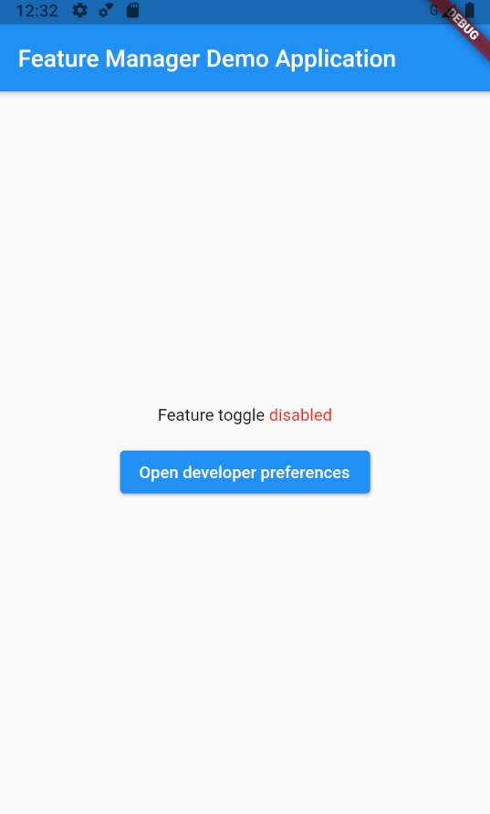
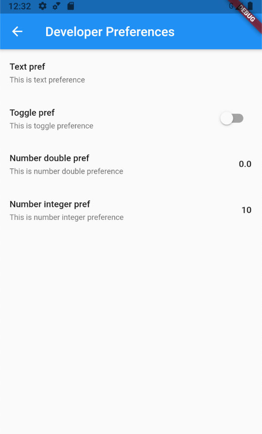

# Feature Manager for Flutter

[]

Feature manager allows you to hide some unfinished/secret feature from your users, or experiments, that can be managed
from remote data source.

 

## Getting Started

- [Installation](#installation)
- [Basic Usage](#basic-usage)

### Installation

Add

```bash
feature_manager : ^lastest_version
```

to your `pubspec.yaml`, and run

```bash
flutter packages get
```

in your project's root directory.

### Basic Usage

#### Create feature list

Create file where you will store your feature list and create features inside.

```dart
import 'package:feature_manager/feature_manager.dart';

class Features {
  static const Feature textFeature = Feature(
    key: 'dev-prefs-text-pref',
    title: 'Text pref',
    description: 'This is text preference',
    defaultValue: '',
    type: FeatureType.feature,
    valueType: FeatureValueType.text,
  );

  static const Feature booleanFeature = Feature(
    key: 'dev-prefs-bool-pref',
    title: 'Toggle pref',
    description: 'This is toggle preference',
    defaultValue: false,
    type: FeatureType.feature,
    valueType: FeatureValueType.toggle,
  );

  static const Feature doubleFeature = Feature(
    key: 'dev-prefs-double-pref',
    title: 'Number double pref',
    description: 'This is number double preference',
    defaultValue: 0.0,
    type: FeatureType.feature,
    valueType: FeatureValueType.doubleNumber,
  );
  static const Feature integerFeature = Feature(
    key: 'dev-prefs-integer-pref',
    title: 'Number integer pref',
    description: 'This is number integer preference',
    defaultValue: 0,
    type: FeatureType.feature,
    valueType: FeatureValueType.integerNumber,
  );

  static const List<Feature> values = <Feature>[
    Features.textFeature,
    Features.booleanFeature,
    Features.doubleFeature,
    Features.integerFeature,
  ];
}
```

Using FeatureManager check whether feature is enabled.
Preferable way to create FeatureManager instance is to use DI (Provider, GetIt etc.).

```dart
...
FutureBuilder<bool>(
  initialData: Features.booleanFeature.defaultValue as bool,
  future: featureManager.isEnabled(Features.booleanFeature),
  builder: (BuildContext context, snapshot) {
    final bool isEnabled = snapshot.data ?? false;
...
```

#### Modify feature values in DEBUG (develop) mode
To do it, you can simply open DeveloperPreferences screen in any part of your app.
You should pass list of your features as parameter for this screen.
P.S. You should hide this button for production builds.

```dart
Navigator.of(context).push(
  MaterialPageRoute(
    builder: (BuildContext context) =>
      DeveloperPreferencesScreen(Features.values),
    ),
);
```

### Feature parameters


| Parameter                 |                       Default                       | Description                                                                                                             |
| :------------------------ | :-------------------------------------------------: | :---------------------------------------------------------------------------------------------------------------------- |
| **key** *String*          |                        required                     | This key will be used to store value in local storage.                                                             |
| **type** *FeatureType*    |                         `FeatureType.feature`       | It can be used to separate local features and experiments driven by some remote provider. |
| **valueType** *FeatureValueType*|                         required              |  Type of value of the feature. If you need toggle, use `FeatureValueType.toggle` |
| **title** *String*        |                          required                   | Title that will be used inside Developer Preferences Screen.     |
| **remoteSourceKey** *String*|                                                   | TBD. Used to fetch value from remote source. |
| **description** *String*  |                                                     | Description that will be used inside Developer Preferences Screen. |
| **value**  *Object?*      |                          Null                       | Stored value of the Feature. Will be fetched from local storage. |
| **defaultValue** *Object?*|                   Null                              | Default value of the Feature. Will be returned by `FeatureManager` if stored value is `Null` |

```dart
enum FeatureType { feature, experiment }
```
```dart
enum FeatureValueType { text, toggle, doubleNumber, integerNumber }
```

## Todo

- [ ] Use remote sources.
  - use abstraction to make it easy for anyone to implement new providers like:
    - custom api config
    - firebase remote config
    - amplitude experiments
    - etc.

- [ ] Use permanent notification to access dev settings

- [ ] Add sync calls of `isEnabled` and `getValue` for `FeatureManager`

## Contributions
Feel free to contact me (a.e.getman@gmail.com) or create Merge Requests for this repository :)